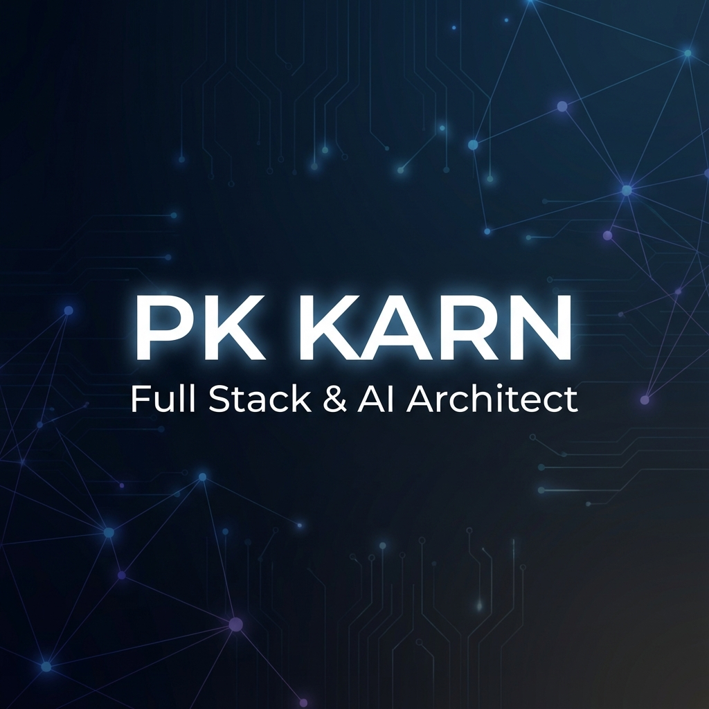

  

   

  <h2 align="center">🚀 Transforming ideas into digital reality.</h2>

   

  
  
  
  

    

  

---

### ⚡ About Me

I am a passionate **Full Stack Developer** and **AI Architect** with a knack for building high-performance applications. My expertise lies in visualizing complex data structures and leveraging Large Language Models to solve real-world problems.

- 🔭 **Current Focus**: DEveloping next-gen **Graph Visualizations** and **AI-driven solutions**.
- 🌱 **Learning**: Advanced **System Design** and **Generative AI** patterns.
- 📝 **Writing**: Sharing insights on tech and code at [**LogChit**](https://logchit.com).
- 💬 **Let's Talk**: Specialized in **Vue/React**, **Python**, **Graph Theory**, and **Cloud Architecture**.

> _"Code is like humor. When you have to explain it, it’s bad."_

---

### 🛠️ Tech Stack

   
  
    
  
    
  
    
  

---

### 📊 GitHub Activity

   
  <!-- Using a different theme and layout to ensure better reliability and aesthetics -->
  
  

   
  

---

  

